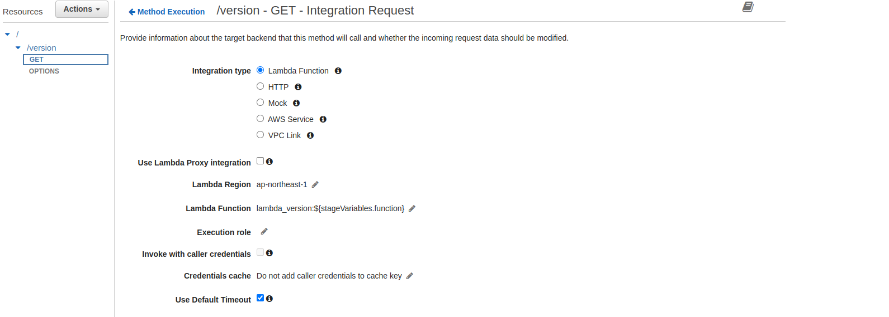

## using stage variabe 
- access variable using **${stageVariables.variable_name}**
- in each stage of api gateway we need to define all variable for that stage like image bellow
  
- in intergration with lambda function we use variable like this
  
- we need to run command to allow api gateway execute lambda function
- in lambda we will create two version for lambda, we will  use alias to point to version
  
