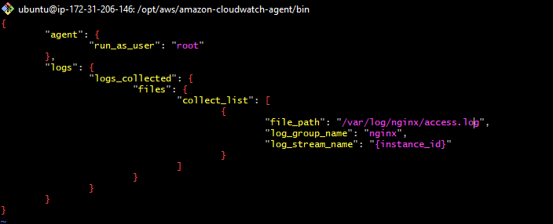

#### download file using wget
````
wget https://s3.amazonaws.com/amazoncloudwatch-agent/ubuntu/amd64/latest/amazon-cloudwatch-agent.deb
````

#### install using
````
sudo dpkg -i -E ./amazon-cloudwatch-agent.deb
````

#### create configuration file by command and answer the question in this command
````
sudo /opt/aws/amazon-cloudwatch-agent/bin/amazon-cloudwatch-agent-config-wizard
````
default config is /opt/aws/aws-cloudwatch/bin/config.json or something like that


#### start agent
````
sudo /opt/aws/amazon-cloudwatch-agent/bin/amazon-cloudwatch-agent-ctl -a fetch-config -m ec2 -s -c file:configuration-file-path

example
sudo /opt/aws/amazon-cloudwatch-agent/bin/amazon-cloudwatch-agent-ctl -a fetch-config -m ec2 -s -c file:/opt/aws/aws-cloudwatch/bin/config.json
````

### when change config file should run command start again

#### sample config, it will send data in access.log to aws nginx log group

