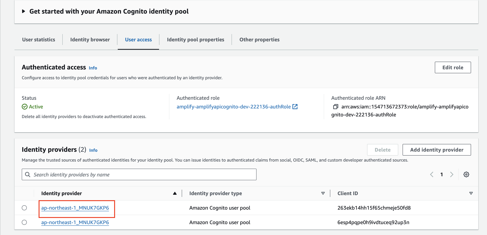
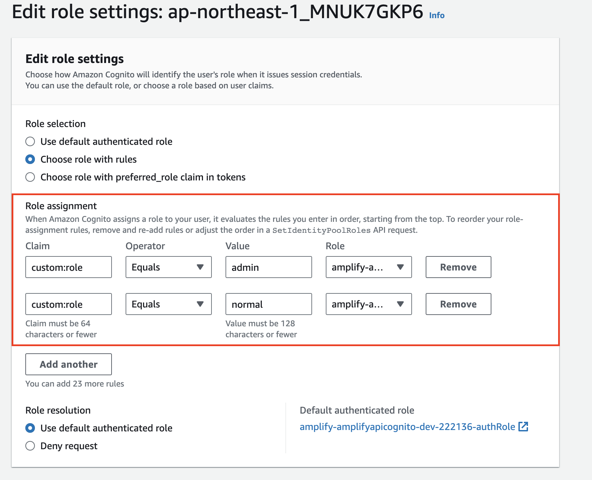

## To use cognito user pool for authorization with api gateway
1. config in api to create new cognito authorizer, define scope for each api that we have
2. we need to use pre-token-generation to change scope of the access token, and use that scope
3. include access_token in Autorhization header whenever you calling api gateway
## To Use cognito dentity pool for role base access selection  In Identity token there is a field call prefered_role  and in cognito identity pool we can config the way how to get role for authenticated user
1. in api gateway we need to use IAM authorizer
2. in amplify js library don't set Authorization header value in order to amplify will automatic sign request for us
3. to test, we just need to change policy in auth role to test

## Config authenticated role base on custom attribute
- Identity Provider
  
- change rule to choose role for authenticated user base on custom attribute
  
  in this image, we configured when  
                                    - custom.role = admin, the role adminRole will be assigned to the user  
                                    - custom.role = normal, the role normalRole will be assigned to the user
  sample policy for adminRole and normalRole
  ````
  // admin role
  {
    "Version": "2012-10-17",
    "Statement": [
        {
            "Sid": "Statement1",
            "Effect": "Allow",
            "Action": [
                "execute-api:Invoke"
            ],
            "Resource": [
                "arn:aws:execute-api:ap-northeast-1:154713672373:2cnlk0u6h6/*/GET/test"
            ]
        }
    ]
  }

  // normal role
  {
    "Version": "2012-10-17",
    "Statement": [
        {
            "Sid": "Statement1",
            "Effect": "Deny",
            "Action": [
                "execute-api:Invoke"
            ],
            "Resource": [
                "arn:aws:execute-api:ap-northeast-1:154713672373:2cnlk0u6h6/*/GET/test"
            ]
        }
    ]
  }
  ````
  
