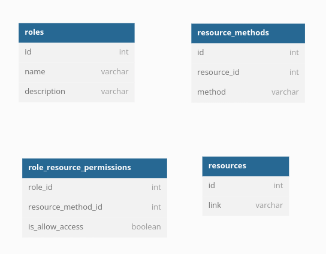

## Cognito authorizer
### Sử dụng được authenticated role trong identity pool
- để sử dụng được role này thì trong lambda function chúng ta sẽ cần phải manual call tới STS service để lấy được các thông tin như Access Token. 
  Secret token ... , sau đó chúng ta sẽ dùng thông tin này để call tới service mong muốn như S3 hay DynamoDB
- sample code in lambda function for nodejs
  ````
  let credential = new AWS.CognitoIdentityCredentials({
        IdentityPoolId: identity_pool_id,
        Logins: { 
            [provider] : token
        }
    }, {
        "region": region
    });
    
    
    const dynamo = new AWS.DynamoDB({
        apiVersion: '2012-08-10',
        credentials: credential
    });
    
    const client = new AWS.DynamoDB.DocumentClient({
        service: dynamo
    })
    
    // call 
    
     let params = {
      TableName : 'products'
    };

    let results = client.scan(params).promise();
    return results;
  ````
  ## Custom authorizer
   we will use lambda for custom authorizer, lambda will  generate policy to determine that api should allow executed or not  
   after user authenticated we will have a role of authenticated user, and base on that role we will have list permission of that user, and then we will generate policy for those permission and return it
   base on this policy, api gateway will make decision to allow this request or not
   ### database diagram for this case
   
