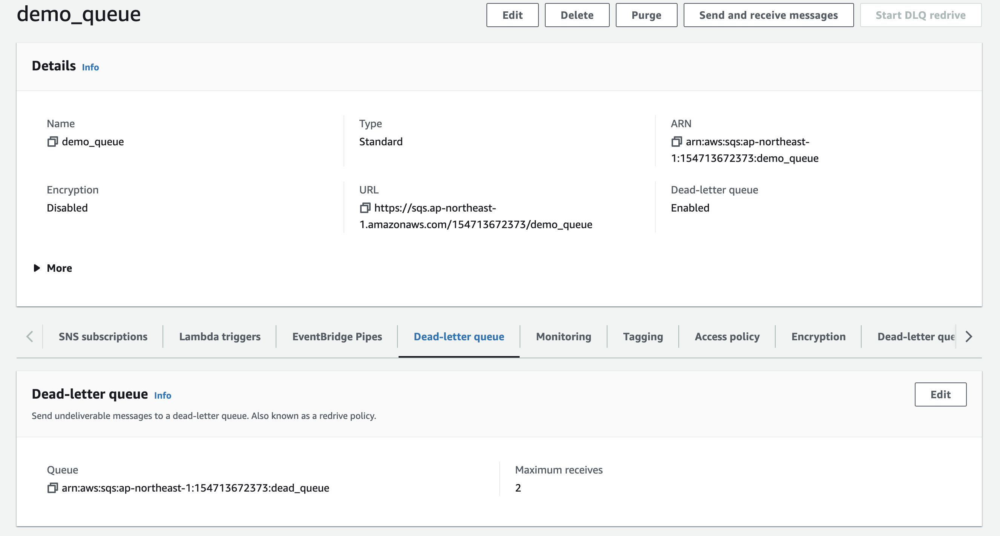

### Dead letter queue
khi mot message duoc consume nhieu lan nhung van that bai thi message nay can duoc day vao dead letter queue de co the xem xet va xu li them
### config
1. Config queue
   - Chung ta se can 2 queue, 1 normal queue va 1 dead letter queue, de luu nhung message bi loi khi so lan consume qua so luong que dinh
     - Normal queue  
       
     - Config dead letter queue  for normal queue
       chung ta can chu y toi tham so **Maximum receives**, tham so nay quy dinh message duoc consume toi ba bao nhieu lan truoc khi bi day vao dead letter queue
       
     - Config lambda function  
       lambda execution role can co cac quen sau truoc khi dang ki la worker cho sqs
       - sqs:DeleteMessage
       - sqs:GetQueueAttributes
       - sqs:ReceiveMessage
2. Lambda workder
   - sqs-worker: consume message for normal queue
   - dead-letter-worker: consume message from dead-letter-queue
