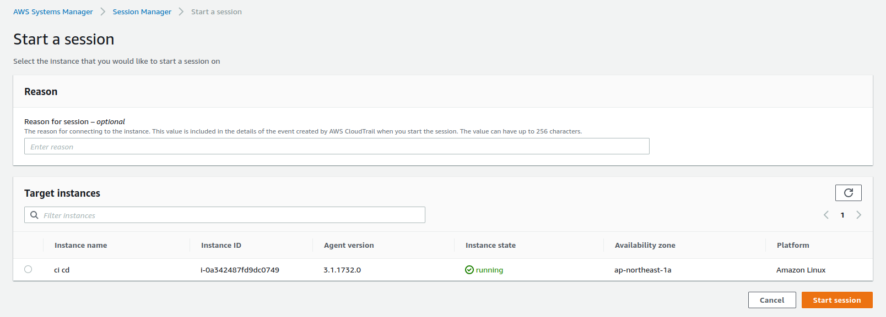

## Private Connect to EC2 instance without ssh key using system manager
  - instance SSM agent on ec2 instance and make sure the sms agent is up and running
     - command to check
       `sudo service aws-ssm-agent status` to check status, 
       `sudo service aws-sms-agent start` to start service
  - create iam role have policy **AmazonSSMManagedInstanceCore**
  - attach role just created to your ec2 instance
  - in session manager menu inside System Manager you will see list of instances can work with system manager and you can start session to connect to instance by choose one instance and click on start button
  
  
## Private Link( connect to Private EC2 instance
  - in order to connect to private ec2 instance we have to create 3 vpc endpoint like image below
     
  
