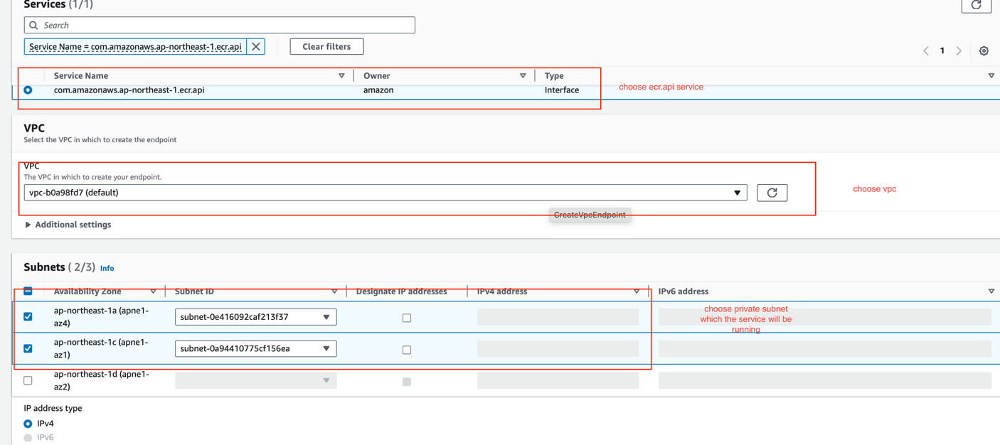
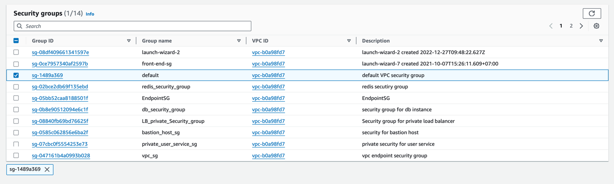
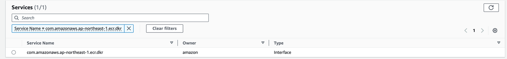
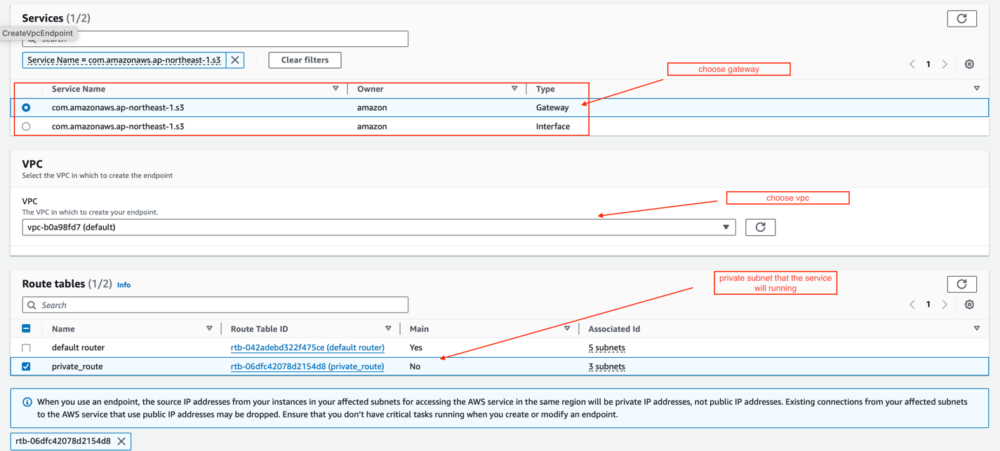
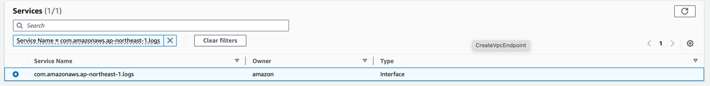

## for all service running in private subnet can pull image and push log to cloud watch log we need create vpc endpoint for ecr and aws cloud watch log as well
1. for ECR
   - create vpc interface endpoint for api
     
     
   - create vpc interface endpoint for dkr (the same with create for api, choose dkr instead)
     
   - create vpc gateway endpoint for s3 because the ecr will use s3 to s tore docker image layer
     
   - create vpc interface endpoint for cloud watch logs ( the same with create for api, choose logs instead)
     
     