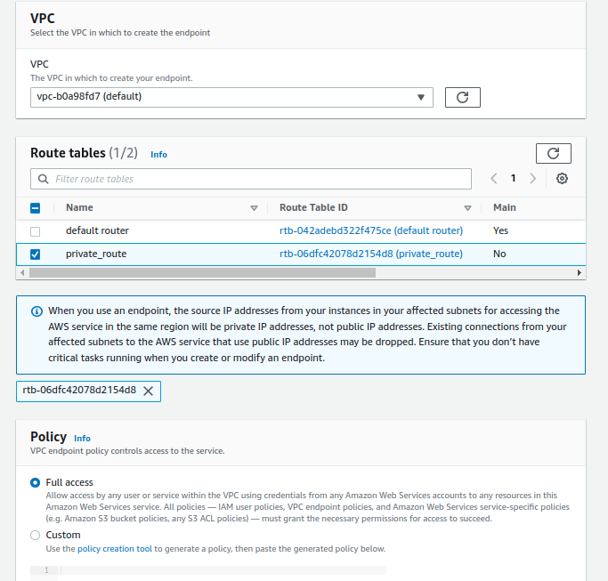

Endpoint allow you to connect to aws services using a private network instead of the public network
they remove the need of Iternet gateway, nat gateway to access other aws services
## Gateway Endpoint
use to connect to S3 and Dynamodb
### Setup VPC gateway endpoint to allow connect from ec2 private instance to s3
  - you need to have 1 public instance(bastion host) and 1 private instance
  - attacch to instance role  that has permission to access to s3
  - in vpc menu, choose **End point** and choose information as below
   
   
  - inside private instance we can use aws cli to connect to s3 
## interface Endpoint
use to connect to other services
### Setup
  - we need to have 1 public instance and 1 private instance
  - we also need to create role that have permission to access sqs and then attach it to private instance
  - in vpc menu, choose **Endpoint** and choose information as bellow
  - inside private instance we can use `aws cli` to connect to sqs  
       `aws sqs list-queues --region ap-northeast-1 --endpoint-url https://sqs.ap-northeast-1.amazonaws.com`

