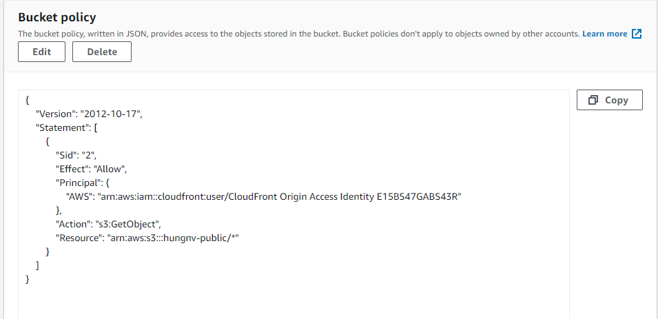

#### OAI(OAC: origin access control)
is special Cloud font user, use this user to setup bucket policy in s3 for allow public access only from this use
it mean only from this cloud font distribution

after setup this policy,user can access to object only from clound font distribution and can't access using s3 url

#### signed url or cookies 
is used to restrict access to resource
user have to pay fee for access resource

signed url: restrict for individual files
cookies: restrict for multi files

#### security application load balancer using cloud font and secret manager architect
[security](./images/)
