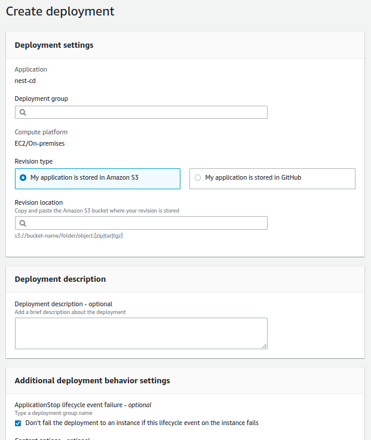

## Note
During a deployment, the CodeDeploy agent runs the scripts specified for ApplicationStop, BeforeBlockTraffic, and AfterBlockTraffic in the AppSpec file from the previous successful deployment. (All other scripts are run from the AppSpec file in the current deployment.) If one of these scripts contains an error and does not run successfully, the deployment can fail  
**To fix this issue**: Use the CodeDeploy console to create a deployment. On the **Create deployment** page, under ApplicationStop lifecycle event failure, choose Don't fail the deployment to an instance if this lifecycle event on the instance fails. **see image below**


#### create instance and role
1. create instance profile with policy like this
````
{
    "Version": "2012-10-17",
    "Statement": [
        {
            "Action": [
                "s3:Get*",
                "s3:List*"
            ],
            "Effect": "Allow",
            "Resource": "*"
        }
    ]
}
````

2. create role with permission like policy above
3. create instance and choose role above for instance
4. assign tag for instance, the CodeDeploy will use this tag to know instance for deploy

#### install code Deploy agent on ec2 instance
````
sudo apt update

sudo apt install ruby-full

sudo apt install wget

cd /home/ubuntu

wget https://bucket-name.s3.region-identifier.amazonaws.com/latest/install

for more information to get link visit link below
https://docs.aws.amazon.com/codedeploy/latest/userguide/codedeploy-agent-operations-install-ubuntu.html

chmod +x ./install

sudo ./install auto
````

#### check agent service is running
````
sudo service codedeploy-agent status
````

#### Note: if you attach iam role for instance after instance started, you have to restart codedeploy-agent service
````
sudo service codedeploy-agent restart
````

#### watch log of codeDeploy
##### view configuration of codeDeploy at /etc/aws/codeDeploy/conf or /etc/codeDeploy to know where log is stored
````
agent log:
/var/log/aws/codedeploy-agent/codedeploy-agent.log

deployment logs
/opt/codedeploy-agent/deployment-root/deployment-logs/codedeploy-agent-deployments.log
````
#### create appspec.yml in root of project directory


