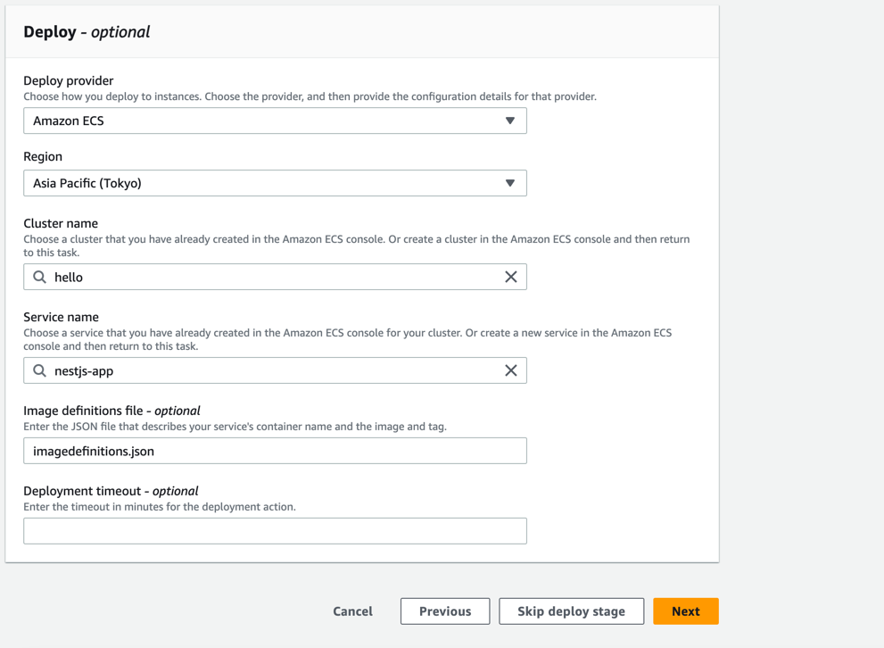
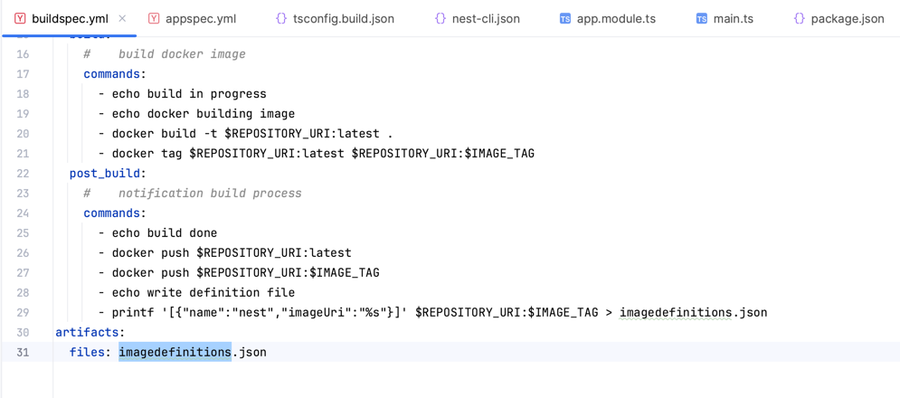

### CI, CD ecs
#### when integrate between ecs and codepipeline only we need to change imageuri for image in container
1. you need a cluster on ecs
2. you need definition for a service on ecs
3. you need create a service on ecs

### Config code pipeline
1. please note that the field image definition is important, it must be the name of the file that is outputted from code build process
  

2. output from code build  
